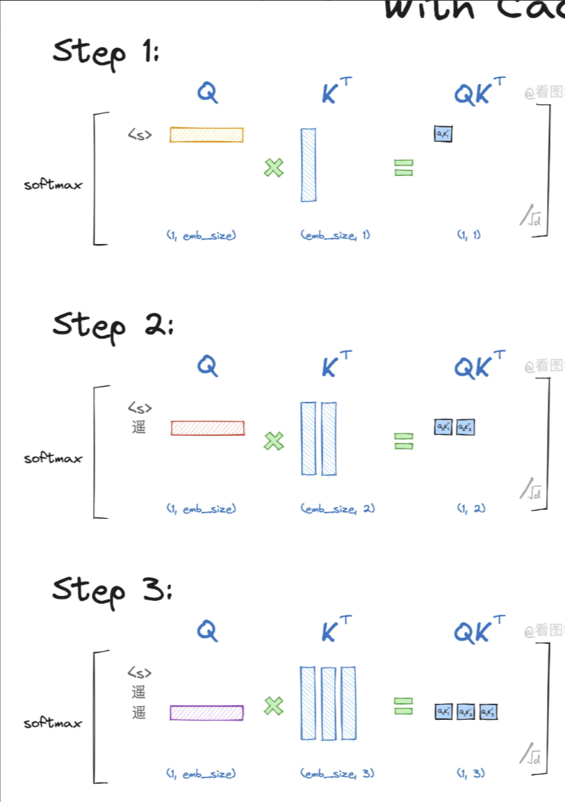
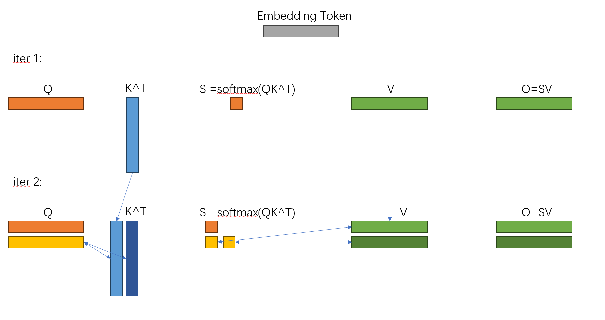
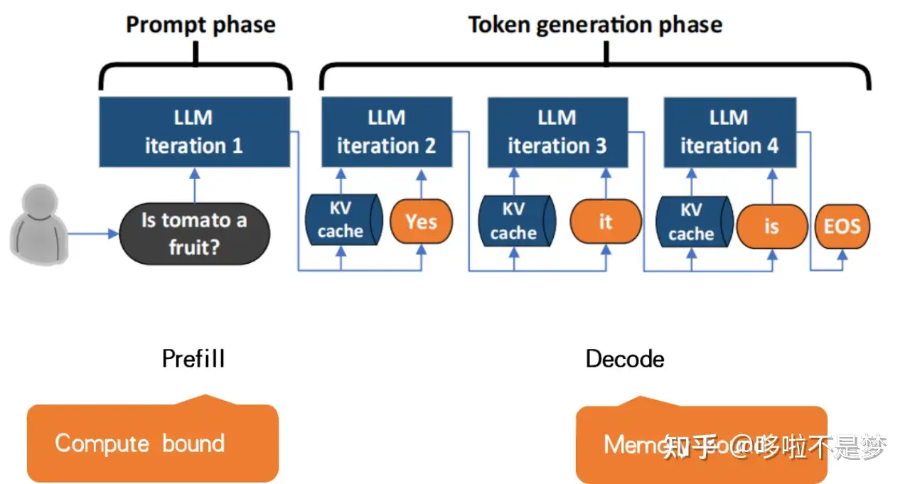
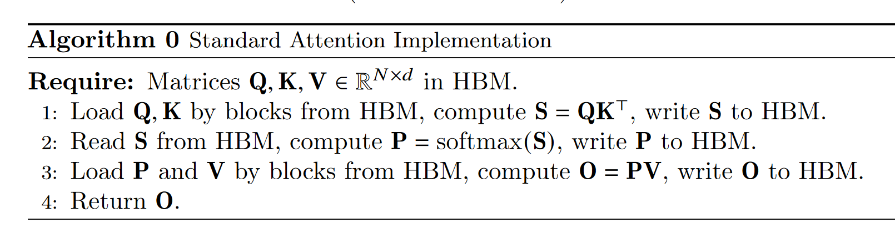
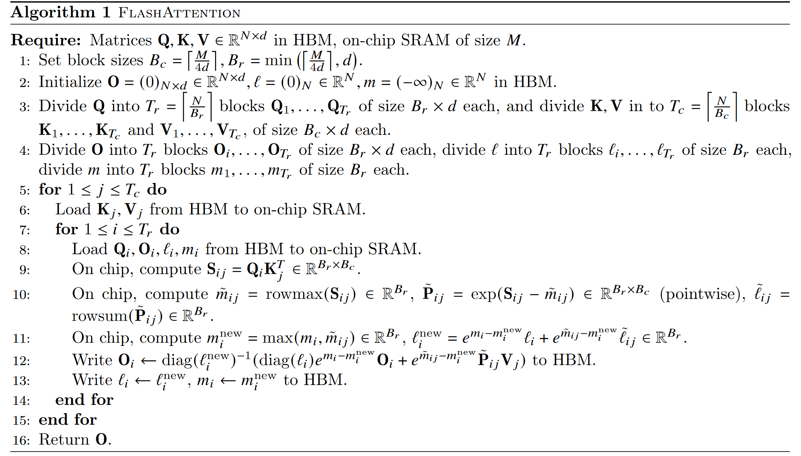
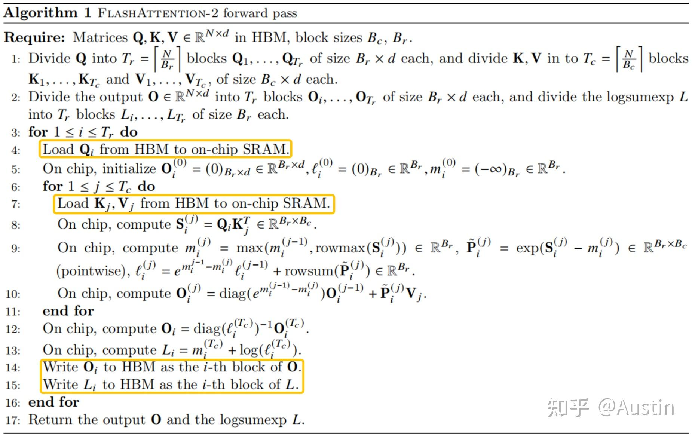

# Attention和KV Cache
## 内存受限和计算受限
计算带宽$BW_{math}$指的是处理器每秒钟可以执行的数学计算次数，单位通常是Flops。
内存带宽$BW_{mem}$指的是处理器每秒钟从内存中读取的数据量，单位是Bytes/s。
算数强度定义为：$\frac{N_{op}}{N_{byte}}$。

对于特定的硬件，其$\frac{BW_{math}} {BW_{mem}}$是固定的，比如A100-40GB的为201Flops/Bytes，
**以下的计算都以这个数据为基准，同时计算精度均选择半精度float16。**

对于特定的算子，其理论的算数强度也是确定的。
比如对于两个向量内积，需要$n$次乘法和$n$次加法，计算量为$2n$ Flops，半精度情况下，需要的内存大小为$4n$ Bytes，算数强度为$0.5$ Flops/Bytes。因此是一个内存受限的算子。

对于矩阵乘法，$A\in \mathbb{R^{m\times m}}, B\in \mathbb{R^{m\times m}}$，$AB$的计算量为$2m^3$ Flops，内存大小为$4m^2$ Bytes，算数强度为$0.5m$ Flops/Bytes，因此当$0.5m > 201$时，矩阵乘法会变成计算受限算子。

在LLM的情景中，矩阵乘法分为两种情况：QKV投影: $[L, D] \times [D, D]$，$QK^T$注意力分数: $[L, D] \times [D, L]$。

对于第一种情况：$[L, D] \times [D, D]$，$L$是序列长度，$D$的embedding的维度。这里我直接引用[知乎](https://zhuanlan.zhihu.com/p/639228219?s_r=0)的一张表，可以看出这部分往往是内存受限的。

| N    | d   | ops/bytes | 受限类型       |
|------|-----|-----------|----------------|
| 256  | 64  | 43        | <201, memory-bound |
| 2048 | 64  | 60        | <201, memory-bound |
| 4096 | 64  | 62        | <201, memory-bound |
| 256  | 128 | 64        | <201, memory-bound |
| 2048 | 128 | 114       | <201, memory-bound |
| 4096 | 128 | 120       | <201, memory-bound |
| 256  | 256 | 85        | <201, memory-bound |
| 2048 | 256 | 205       | >201, math-bound   |
| 4096 | 256 | 228       | >201, math-bound   |

对于第二种情况：$[L, D] \times [D, L]$，计算量为$2L^2 D$ Flops，内存大小为$4LD$ Bytes，算数强度为$0.5L$，而LLM中一般$L>2048$，所以这一部分显然是非常计算受限的。

因此可以看出，计算Attention的过程中，性能瓶颈主要就在QK注意力分数的计算，而这部分只是一个矩阵乘法，是一个已经被完完全全优化到头的算子，很难再有什么新优化了。

## KV Cache
由于LLM输入序列的因果性，$q_i$只能和$k_{0,...,i}$做注意力计算，不能和$k_{i+1,...,n-1}$做注意力，这点和CV中用的Attention是不一样的。这里直接用大佬的图：

可以看出，在正常的Attention流程中，对于新来的$x_i$，需要读取$x_{0,...,i}$并乘以$W_k$，得到$k_{0,...,i}$，而在上一个iter中已经计算了$k_{0,...,i-1}$，我们只需要把之前计算的结果缓存下来，这就是K Cache。

此时我们计算注意力分数的流程是：给定当前iter的输入$x_i$，计算$q_i = W_q x_i$，$k_i = W_k x_i$，$S_i = q_i [K_{i-1} | k_i]$。$K_{i-1}$是上一个iter中缓存的$K$矩阵，$S_i$是当前token的注意力分数，是最终QK矩阵的第$i$行。从而避免了对$k_{0,...,i-1}$的重复计算，以提升性能。

以上是利用K Cache减少注意力分数$S = QK^T$的计算量的过程，同理也可以利用V Cache减少加权$O = SV$的计算量。

对于LLAMA2-7B，其规模为：$N=32, D=128, H_{attn}=32, H_{kv}=8$，一个token对应的KV Cache大小就是$sizeof(fp16) \times N D H_{kv} \times 2 = 128KB$，上下文窗口为$L=4096$，故需要的总KV Cache大小为$4095 \times 128KB$，约为0.5GB。

## KV Cache的实现
从上述过程中我们可以看出，我们可以通过维护一个

## 面试问题
### 1.为什么用KV Cache？
减少KV Projection的计算量，以提高推理速度。

因为自回归模型每次预测下一个token时，都需要依赖于之前的所有token，对于一个新来的token，分别通过QKV投影后，该token对应的q向量要与之前所有的k向量进行查询，以计算注意力分数，因此我们可以把之前的k向量都缓存起来，以避免这部分的冗余计算。这就是K Cache的作用。

在计算对于V的加权时，也可以通过缓存之前计算的v向量的方式，避免对v projection的重复计算，这就是V Cache的作用。

同时因为我们有了KV Cache，对于每个新来的token，只需要做GEMV运算就可以，而不需要进行GEMM运算。

面试时可以用ppt画图说明：。

### 2.解码分为几个阶段？
Prefill阶段和Decoding阶段。

Prefill阶段可以视作第一个iter，也就是输出第一个token的阶段，会对输入的prompt进行处理，计算相应的KV Cache。这一阶段所有的token可以并行处理，因为Prompt是一次性输入的，这部分的计算一般就变为了计算密集型。

Decoding阶段指的是Prefill之后的阶段，也就是输出第二个及之后token的阶段，每次推理需要QKV投影，得到当前token的qkv向量，然后通过读取KV Cache获得之前的kv向量，最后执行Attention计算完成推理。

### 3.KV Cache消耗的显存？/ KV Cache的副作用？/ 如何缓解？
消耗的显存在上面讲过了。

副作用就是额外消耗显存。在长上下文窗口的情况下会消耗很多显存。在serving系统中，一般还会进行批量解码，显存的消耗还需要乘以batch_size。

可以通过KV Cache量化的方式进行缓解，当然量化本身也是对于系统精度和效率的取舍，需要考虑具体系统的多种因素。

### 4.量化方式
HQQ，AWQ、分组量化

# Flash Attention
Flash Attention加速的是注意力的计算，不考虑QKV投影。
## 一般Attention

## Flash Attention V1
给定QKV的维度为$[B, L, H, D]$，V1版本的主要思路是在Batch和Head维度上并行，分配到不同的Thread Block上，反映到CUDA的启动参数就是`grid(B, H)`。
对于每个Thread Block，需要处理的就是一个$[L, D]$的注意力计算，但一般情况$L$比较大，GPU的SM资源不足，所以需要对计算再次进行拆分。

Flash Attention在$L$维度上再次进行拆分，将$Q$拆成$T_r$份，将$KV$拆成$T_c$份。
这样就得到了$T_r$个$Q_i[B_r, D]$，和$T_c$对$K_j[B_c, D], V_j[B_c, D]$。

在每个Thread Block上，执行两层循环，外层循环遍历$K_j, V_j$，内层循环遍历$Q_i$，完成一次$[L, D]$的注意力计算。

可以看出每计算一次$Q_i$，都需要使用新的$m_i, l_i$更新之前的结果$O_i$，为此，需要将$O_i$反复读取/写入到HBM，重复$T_r$次，这部分将在V2进行优化。

## Flash Attention V2
V2的第一个大修改就是将$Q_i$的遍历移到外层循环，$K_j, V_j$的遍历移到内层循环，这样做的好处就是无需反复从HBM存取$O_i$。

